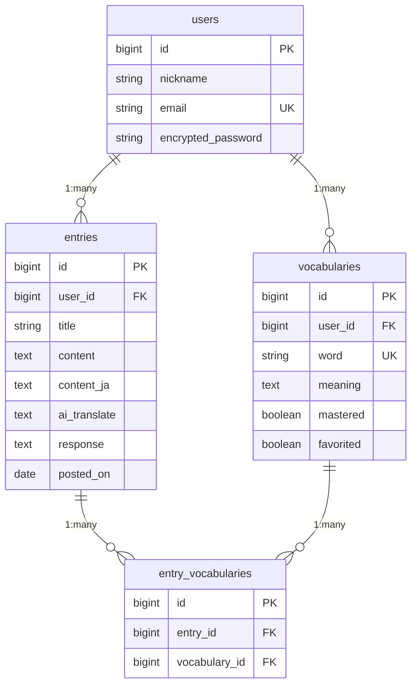

# AI Journal

## アプリケーション概要

AI Journalは、AIの力でジャーナリングという英語学習方法をサポートするアプリです。
ジャーナリングとは日記を書き出すことで英語のアウトプットを練習する方法です。
語彙力や文法力の向上、アウトプット習慣の定着に効果的で、英語で文を組み立てる練習を通じてスピーキングやライティングの力を養うことが目的です。

本アプリでは、ユーザーの日記の内容に対してAIが文法の誤りや不自然な表現を指摘し、より自然で伝わる英文を提案してくれます。

「いきなり英語で書くのは難しい」というユーザーのために、日本語で下書きし、AIが英文を提案する機能も搭載しています。
また、学習した単語を登録できるMy Dictionary機能では、日記と単語が自動的に紐づくため自分の文章がそのまま例文になるため、単語の記憶定着に効果的です。
単語ごとに「修得済み」「お気に入り」を設定して管理でき、フラッシュカード形式で効率的に復習することも可能です。

「せっかく学んだ英語を使う機会がない」
「英文の添削を受ける機会がない」
「書きたい内容を英語で表現できない」
「覚えた単語が定着しない」
——そんな悩みを解決するために、AI Journalを開発しました。


## URL
https://ai-journal-k7ua.onrender.com

## テスト用アカウント
### Basic認証
- **ID**: admin
- **パスワード**: 2222

### ログイン情報
- **メールアドレス**: test@example.com
- **パスワード**: password

※ログインせずにトップページから新規登録も可能です。

## 利用方法

### 1. アカウント作成・ログイン
- トップページの「新規登録」ボタンからニックネーム、メールアドレス、パスワードを入力してアカウントを作成
- または上記のテスト用アカウントでログインして機能をお試しいただけます

### 2. 日記の作成
- ログイン後、「新規日記作成」ボタンをクリック
- 以下の2つの方法で日記を作成できます：
  - **英語で直接書く**: 英語に自信がある方は、そのまま英文を入力
  - **日本語で下書きする**: 日本語入力欄に書いた後、「翻訳」ボタンをクリックすると、AIが英文を自動生成
- タイトルは任意で入力可能（未入力の場合、AIが日記の内容から自動的に生成）
- 画像を添付することも可能（思い出の写真などを日記と一緒に保存できます）
- 投稿保存前あるいは保存後に「AIからフィードバックをもらう」ボタンをクリックすると、AIが英文の文法ミス、不自然な表現、より良い言い回しを指摘し、改善案を提案してくれます
- AIのフィードバックは学習者に寄り添った優しいトーンで、励ましのメッセージも含まれます

### 4. 単語帳機能（My Dictionary）
- **単語の登録**: 日記の詳細ページで覚えたい単語をダブルクリックすると、単語帳に登録できます。My Dictionaryページでも単語の登録が可能です。
- ご自身日記が例文として紐づけられます。
- **単語の管理**: My Dictionaryページで登録した単語を一覧表示して確認できます
  - 「習得済み」チェックで学習進捗を管理
  - 「お気に入り」機能で重要な単語をマーク
  - フィルター機能で絞り込み検索が可能
- **フラッシュカード**: カード形式で単語を効率的に復習（未習得の単語に絞って復習が可能）


## アプリケーションを作成した背景
私は学生時代に海外留学を経験しましたが、帰国後は英語を使う機会が極端に減り、使わない期間が続くほど自身の英語力が目に見えて衰えていく感覚がありました。

英語を使う場を求めて英会話スクールにも通いましたが、
- 毎回予約することが負担
- 通学が面倒
- 授業料が高い
といった理由から継続できませんでした。また、海外の友人と話す機会が稀にあっても、友人は私の英語の誤りを指摘してくれるわけではなく、学習効果は限定的でした。

そこで私は、「いつでもどこでも英語をアウトプットでき、かつ自分の誤りをその場で認識して修正できる仕組み」 が必要だと考えました。留学時代に効果を実感していたジャーナリング（英語日記）に加え、AIによるフィードバックを組み合わせることで、その環境を自分で再現しようと考えたことが本アプリ開発の出発点です。

AIを活用して英語学習を自分ひとりの中で完結できる構造は、
私のような「せっかく英語を学んだのに使う場がない」人だけでなく、
「英語を間違えるのが怖くて実践の場に出られないけど勉強したい」人にも価値があると考えています。
日本語下書き機能を設けることで英語で文章を書くハードルを下げ、初級者から中上級者まで幅広い層が**“アウトプット → フィードバック → 改善” のサイクルを手軽に継続できる環境**を提供します。


## 主要機能の説明およびGIF
- AI自動翻訳
  + 日本語下書きをワンクリックで英文に変換（GPT-4o-mini使用）
  + 「この翻訳を使用」をクリックするとAI生成した文章が英文フィールドに自動入力されます。
[](https://gyazo.com/8e26ef55e3e3fd322c525022c11fc04c)

- AI英文添削
  + 文法・表現ミスの指摘と一言コメント
  + 投稿保存前・保存後どちらでも使用可能
[](https://gyazo.com/32a14d1755d8c6442a9ec40f86d4954c)

- AIタイトル自動生成
  + 日記保存時にタイトル未入力の場合、本文の内容をもとに自動で適切なタイトルを生成[](https://gyazo.com/c668d3ca3fc4c560f3fd6bf7f63c0568)

- 単語登録機能
  + 本文の英単語をダブルクリックするとモーダルが表示（すでに登録済み単語の場合、単語編集モーダルが表示）
  + 意味を入力して登録／自動的に日記と紐付け
[](https://gyazo.com/0dc4bee6a7b740b3a5a50a57b1299e9d)

- フラッシュカード復習機能
  + ユーザーの登録した英単語をフラッシュカード形式で復習
  + 英→日、日→英の双方向学習
  + 未習得単語のみに切り替え可能
[](https://gyazo.com/38725ad608f1b530db6bcd05058378cc)

## 実装予定の機能
- **タグ機能**: 日記をカテゴリー別に分類・管理できる機能
- **日記の公開機能**: 他のユーザーと日記を共有し、フォロー、いいね、コメントなどで交流できる機能
- **詳細な統計・分析機能**: 学習の進捗をグラフで可視化し、弱点を分析する機能
- **音声入力機能**: マイクから英語を吹き込んで日記を作成できる機能
- **単語テスト機能**: 習得度を測定するための小テスト機能

## データベース設計



## 画面遷移図

```
【Devise】
  ├─ 新規登録
  │     └─ 登録完了 → 【ホーム】
  └─ ログイン → 【ホーム】

【ホーム】
  ├─ 新規日記作成
  │     ├─ 日本語下書き → AI英訳
  │     ├─ 英文入力 → AIフィードバック表示
  │     └─ 保存 → 【日記詳細】
  │           ├─ 単語ダブルクリック → 単語登録（モーダル）
  │           ├─ 単語クリック → 単語編集（モーダル/遷移）
  │           ├─ 編集 → 【日記編集】→ 保存 → 【日記詳細】
  │           └─ 削除 → 【ホーム】
  │
  ├─ カレンダービュー
  │     └─ 日記タイトル選択 → 【日記詳細】
  │
  ├─ My Dictionary
  │     ├─ 単語一覧（全て / お気に入り / 未習得）
  │     ├─ フラッシュカード表示
  │     ├─ 単語編集
  │     └─ 単語削除
  └─ ユーザー登録情報編集
        ├─ ニックネーム・メールアドレス・パスワードの変更
        └─ ユーザー削除
```

## 使用技術

### バックエンド
- Ruby 3.2.0
- Ruby on Rails 7.1.0
- MySQL 8.0
- PostgreSQL
- Puma
- S3

### フロントエンド
- Hotwire (Turbo + Stimulus)
- JavaScript (ES6+)
- HTML5 / CSS3
- FullCalendar
- Kaminari

### 認証・セキュリティ
- Devise
- Basic認証

### 外部サービス・API
- OpenAI API (GPT-4o-mini)
- Active Storage
- Render

### テスト
- RSpec
- FactoryBot
- Capybara
- Selenium WebDriver

### その他のGem・ライブラリ
- ImageProcessing / MiniMagick
- Importmap


## ローカルでの動作方法
```bash
# リポジトリをクローン
git clone https://github.com/yujimonkawa/ai_journal.git
cd ai_journal

# 依存関係をインストール
bundle install

# データベースの作成とマイグレーション
rails db:create
rails db:migrate

# 環境変数の設定
# `OPENAI_API_KEY`: OpenAI APIキー（必須）
# `BASIC_AUTH_USER`: Basic認証のユーザー名（本番環境用）
# `BASIC_AUTH_PASSWORD`: Basic認証のパスワード（本番環境用）

# サーバーの起動
rails server

# ブラウザで http://localhost:3000 にアクセス
```

## 工夫したポイント

1つ目は、日記詳細画面からシームレスに単語登録できるUIです。
日記本文中の英単語をダブルクリックするだけでモーダルが開き、その場で登録できるようにしました。ページ遷移を挟まないことで「読んでいる文脈のまま」単語を記憶に結びつけられるため、自分が実際に使った英文と一緒に単語が定着しやすい構造を意識しています。

2つ目は、OpenAI API を用いた AI フィードバック機能です。
「何を・どう指摘するか」が明確になるようプロンプト設計を試行錯誤し、なおかつ学習者のモチベーションを削がないように“丁寧で前向きなトーン”でフィードバックが返るように調整しました。単なる自動添削ではなく、継続意欲を損なわない言い回しになるよう品質を重視しています。

3つ目は、日記の日本語下書き機能です。
当初の要件定義時点では実装する予定のなかった機能でしたが、MVP完成時点のユーザーヒアリングで、そもそも英語で日記を書くことがハードルが高いという声を多くいただきました。
そのため、まずは日本語で自由に下書きし、その内容をもとにAIが英文に変換する導線を用意しました。「言語化のアイデアはあるが英語にできない」という初期段階の壁を取り除くことで、英語に触れることそのものを習慣化できるようにしています。

## 改善点
1. **AI機能の拡張**
   - **ストリーミングレスポンス**: OpenAI APIのストリーミング機能を活用し、リアルタイムでフィードバックを表示
   - **パーソナライズ**: ユーザーの学習レベルや過去のミス傾向を分析し、パーソナライズされたフィードバックを提供
   - **チャット機能**: ユーザーが自由にAIに質問できるチャット機能の実装
   - **音声読み上げ**: Web Speech APIを使った英文の発音サポート
   - **文法解説**: 指摘された誤りに対する詳しい文法解説の追加

2. **ソーシャル機能**
   - ユーザーの検索・フォロー機能
   - 日記の公開設定（全体公開/フォロワーのみ/非公開）
   - コメント・いいね機能
   - 学習グループやコミュニティ機能
   - ランキングシステム（投稿数、ストリークなど）

3. **分析・可視化機能**
   - Chart.jsなどを使った学習データのグラフ化
   - 月別/週別の投稿頻度の可視化
   - よく使う単語・フレーズの分析
   - ユーザーの繰り返しやすい文法ミスのパターン抽出と通知
   - 語彙数の増加グラフ

4. **モバイルネイティブアプリ化**
   - React Native / Flutterを使用したiOS/Androidアプリ開発
   - プッシュ通知による継続リマインダー
   - オフライン対応（下書き保存、後で同期）

5. **その他の機能追加**
   - タグ・カテゴリー機能による日記の分類
   - 複数言語対応（英語以外の言語学習にも対応）
   - 音声入力機能（Web Speech API）
   - 定期的な復習リマインド機能

知人に実際に利用してもらい、ユーザーヒアリングを行いながらその他にも改善案を検討中です。

## 制作時間
**約180時間（約3週間）**

### 詳細な内訳

| フェーズ | 時間 | 主な作業内容 |
|---------|------|-------------|
| 要件定義・設計 | 20時間 | アプリケーションの要件整理、機能設計、UI/UX設計 |
| データベース設計 | 10時間 | ER図作成、テーブル設計、リレーション設計 |
| 基本機能実装 | 30時間 | ユーザー認証（Devise）、日記CRUD機能、画像アップロード |
| AI機能実装 | 30時間 | OpenAI API連携、翻訳機能、フィードバック生成、タイトル自動生成 |
| My Dictionary機能 | 30時間 | 単語登録、フラッシュカード、ダブルクリック検出、フィルター機能 |
| UI/UX改善 | 15時間 | カレンダービュー実装、レスポンシブ対応 |
| テスト作成 | 20時間 | RSpecによるモデル・サービス・リクエスト・システムテスト作成（計299テスト） |
| デプロイ・調整 | 20時間 | Renderへのデプロイ、本番環境設定、Basic認証設定、エラー解消 |
| その他 | 5時間 | README作成、コードリファクタリング、ドキュメント整備 |