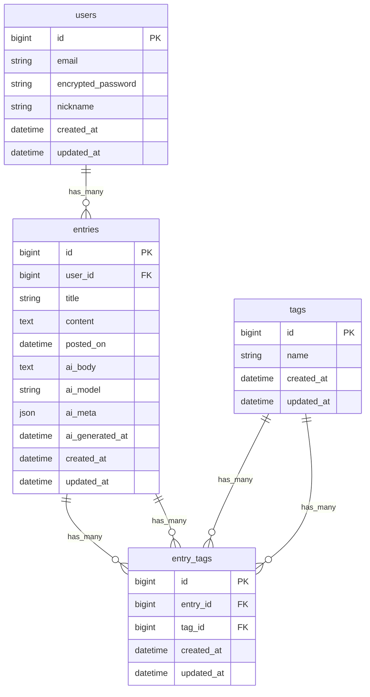

# AI Journal 

## 1. プロダクト概要

* **目的**: 日々の学習・振り返りを“AIフィードバック”で質的に高めるジャーナルアプリ。
* **想定ユーザー**: 英語学習者／自己省察を習慣化したい人。

## 2. スコープ（MVP）

* ユーザー登録/ログイン（Devise）
* 日記の投稿/編集/削除/一覧/詳細（Entries）
* **カレンダー表示（詳細ページから遷移 or 専用ページ）**：日付クリックでその日のエントリへ
* タグ付け & タグでのフィルタ
* ~~ページネーション（Pagy）~~ ※カレンダー中心にするためMVPでは削除（一覧/検索導線を追加したら再導入検討）

> **非MVP（将来的に追加）**: 検索（全文/期間/感情）、要約・感情分析メタの自動付与、スコアリング、日次/週次レポート、画像添付の複数・動画、外部カレンダー連携 等。

## 3. 非機能要件（MVP想定） 非機能要件（MVP想定）

* 認証・権限（自分の投稿のみ編集/削除可）
* セキュリティ: CSRF, Strong Parameters, APIキーはdotenv管理
* レイアウト: レスポンシブ対応
* パフォーマンス: N+1回避（必要に応じてincludes）

## 4. 技術スタック

* **言語**: Ruby 3.2.0
* **フレームワーク**: Ruby on Rails 7.1.0
* **DB**: PostgreSQL 14.19（本番）/ MySQL 8.0.42（開発）
* **Auth**: Devise
* **AI**: OpenAI API（chat）
* **File**: Active Storage（開発=local、 本番=S3）
* **Env**: dotenv-rails
* **Deploy**: Render

## 5. 画面フロー（MVP） 画面フロー（MVP）

1. サインアップ/ログイン
2. 投稿一覧（ページング・タグフィルタ）
3. 新規投稿フォーム
4. 詳細（本文 + AIフィードバック表示）
5. 編集/削除

## 6. ER 図（MVP）



## 7. テーブル設計（MVP）

### users

| Column                | Type     | Options                   |
| --------------------- | -------- | ------------------------- |
| email                 | string   | null: false, unique: true |
| encrypted_password    | string   | null: false               |
| nickname              | string   | null: false               |
| created_at/updated_at | datetime |                           |

**Association**: has_many :entries

---

### entries

| Column                | Type     | Options                            |
| --------------------- | -------- | ---------------------------------- |
| user_id               | bigint   | null: false, foreign_key: true     |
| title                 | string   | null: false                        |
| content               | text     | null: false                        |
| posted_on             | datetime | null: false（デフォルト: now, **index**） |
| ai_body               | text     |                                    |
| ai_model              | string   |                                    |
| ai_meta               | json     |                                    |
| ai_generated_at       | datetime |                                    |
| created_at/updated_at | datetime |                                    |

**Association**: belongs_to :user / has_many :entry_tags / has_many :tags, through: :entry_tags

**unique index (user_id, date(posted_on))**

**Active Storage**: `has_one_attached :image`（単一）or `has_many_attached :images`（複数）

------------|----------|-------------------------------------------|
| user_id    | bigint   | null: false, foreign_key: true            |
| title      | string   | null: false                               |
| content    | text     | null: false                               |
| posted_on  | datetime | null: false (デフォルト: now)             |
| created_at/updated_at | datetime |                                |

**Association**: belongs_to :user / has_many :entry_tags / has_many :tags, through: :entry_tags / has_many :ai_feedbacks

**Index**: index_entries_on_user_id, index_entries_on_posted_on

---

### tags

| Column                | Type     | Options                   |
| --------------------- | -------- | ------------------------- |
| name                  | string   | null: false, unique: true |
| created_at/updated_at | datetime |                           |

**Association**: has_many :entry_tags / has_many :entries, through: :entry_tags

**Index**: index_tags_on_name (unique)

---

### entry_tags（中間）

| Column                | Type     | Options                        |
| --------------------- | -------- | ------------------------------ |
| entry_id              | bigint   | null: false, foreign_key: true |
| tag_id                | bigint   | null: false, foreign_key: true |
| created_at/updated_at | datetime |                                |

**Association**: belongs_to :entry / belongs_to :tag

**Index**: unique index on (entry_id, tag_id)

---

## 8. バリデーション（MVP例）

* **User**: email（presence, uniqueness, format）, password（Devise既定）, nickname（presence, length: 1..30）
* **Entry**: title（presence, length: 1..100）, content（presence, length: 1..10,000）, posted_on（presence）
* **Tag**: name（presence, uniqueness, length: 1..30）
* **AIFeedback**: body（presence）, model（presence）

## 9. ルーティング（例）

```rb
Rails.application.routes.draw do
  devise_for :users
  root "entries#index"
  resources :entries do
    resources :ai_feedbacks, only: [:create, :index]
  end
  resources :tags, only: [:index, :show]
end
```

## 10. OpenAI 連携の基本フロー（MVP）

1. ユーザーがエントリを作成
2. サーバ側で OpenAI API に本文を投げる（MVPでは同期、将来は非同期化）
3. 返ってきたテキストを `entries.ai_body` に保存、`ai_model`, `ai_meta`, `ai_generated_at` も更新
4. 詳細画面で本文 + AIフィードバックを表示

> **備考**: 実運用は ActiveJob で非同期化、リトライ/エラーハンドリングを `ai_status` 列の追加で可視化も検討

### サービスクラス構成例

* `Ai::Client` … API呼び出しラッパ
* `Ai::GenerateFeedback` … Entry -> Feedback 生成ユースケース

## 11. 代替設計（フィードバックを entries に内包）

MVPではテーブル分離を採用。ただし以下のように `entries` に内包する構成も可能：

* `entries.ai_summary :text`
* `entries.ai_sentiment :string`
* `entries.ai_suggestions :json`


