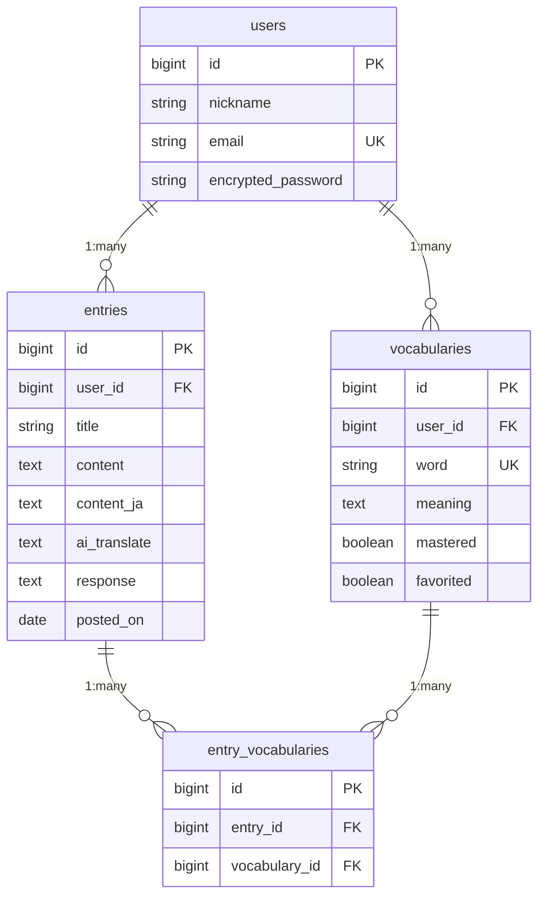

# AI Journal

## アプリケーション概要

AI Journalは、AIの力でジャーナリングという英語学習方法をサポートするアプリです。
ジャーナリングとは日記を書き出すことで英語をアウトプットする練習方法です。
語彙力や文法力の向上、アウトプット習慣の定着に効果的で、英語で文を組み立てる練習を通じて、スピーキングやライティングの力を養うことが目的です。

本アプリでは、ユーザーの日記の内容に対してAIが文法の誤りや不自然な表現を指摘し、より自然で伝わる英文を提案してくれます。

「いきなり英語で書くのは難しい」というユーザーのために、日本語で下書きし、AIが英文を提案する機能も搭載しています。
また、学習した単語や表現を登録できるMy Dictionary機能では、日記と単語が自動的に紐づくため、自分の文章がそのまま例文になります。
単語ごとに「修得済み」「お気に入り」を設定して管理でき、フラッシュカード形式で効率的に復習することも可能です。

「せっかく学んだ英語を使う機会がない」
「英文の添削を受ける機会がない」
「書きたい内容を英語で表現できない」
「覚えた単語が定着しない」
——そんな悩みを解決するために、AI Journalを開発しました。


## URL
https://ai-journal-k7ua.onrender.com

## テスト用アカウント
### Basic認証
- **ID**: admin
- **パスワード**: 2222

### ログイン情報
- **メールアドレス**: test@example.com
- **パスワード**: password

※ログインせずにトップページから新規登録も可能です。

## 利用方法

### 1. アカウント作成・ログイン
- トップページの「新規登録」ボタンからニックネーム、メールアドレス、パスワードを入力してアカウントを作成
- または上記のテスト用アカウントでログインして機能をお試しいただけます

### 2. 日記の作成
- ログイン後、「新規日記作成」ボタンをクリック
- 以下の2つの方法で日記を作成できます：
  - **英語で直接書く**: 英語に自信がある方は、そのまま英文を入力
  - **日本語で下書きする**: 日本語入力欄に書いた後、「翻訳」ボタンをクリックすると、AIが英文を自動生成
- タイトルは任意で入力可能（未入力の場合、AIが日記の内容から自動的に生成）
- 画像を添付することも可能（思い出の写真などを日記と一緒に保存できます）

### 3. AIフィードバックの確認
- 投稿保存前あるいは保存後に「AIからフィードバックをもらう」ボタンをクリックすると、AIが英文の文法ミス、不自然な表現、より良い言い回しを指摘し、改善案を提案してくれます
- AIのフィードバックは学習者に寄り添った優しいトーンで、励ましのメッセージも含まれます

### 4. 単語帳機能（My Dictionary）
- **単語の登録**: 日記の詳細ページで覚えたい単語や表現をダブルクリックすると、単語帳に自動登録できます
- ご自身日記が例文として紐づけられます
- **単語の管理**: My Dictionaryページで登録した単語を一覧表示して確認できます
  - 「習得済み」チェックで学習進捗を管理
  - 「お気に入り」機能で重要な単語をマーク
  - フィルター機能で絞り込み検索が可能
- **フラッシュカード**: カード形式で単語を効率的に復習（未習得の単語に絞って復習が可能）


## アプリケーションを作成した背景
私は学生時代に海外留学を経験し、日常的に英語を使う環境で学習していました。しかし帰国後は英語を使う機会が極端に減り、使わない期間が続くほど、自身の英語力が目に見えて衰えていく感覚がありました。

英語を使う場を求めて英会話スクールにも通いましたが、
- 毎回予約することが負担
- 通学が面倒
- 授業料が高い
といった理由から継続できませんでした。また、海外の友人と話す機会が稀にあっても、友人は私の英語の誤りを指摘してくれるわけではなく、学習効果は限定的でした。

そこで私は、「いつでもどこでも英語をアウトプットでき、かつ自分の誤りをその場で認識して修正できる仕組み」 が必要だと考えました。留学時代に効果を実感していたジャーナリング（英語日記）に加え、AIによるフィードバックを組み合わせることで、その環境を自分で再現しようと考えたことが本アプリ開発の出発点です。

AIを活用して英語学習を自分ひとりの中で完結できる構造は、
「せっかく英語を学んだのに使う場がない」人だけでなく、
「間違えるのが怖くて実践の場に出られない」人にも価値があると考えています。

日本語下書き機能を設けることで英語で文章を書くハードルを下げ、初級者から中上級者まで幅広い層が**“アウトプット → フィードバック → 改善” のサイクルを手軽に継続できる環境**を提供します。


## 主要機能

### 1. AI自動翻訳機能
- 日本語の下書きをワンクリックで英文に変換
- OpenAI GPT-4o-miniを使用し、自然で文脈に沿った翻訳を実現
- 初心者でも安心して英語日記を始められます

### 2. AI英文添削・フィードバック機能
- 投稿した英文に対して、文法ミスや不自然な表現を自動検出
- より自然で適切な表現の提案
- 学習者を励ますポジティブなフィードバック
- 投稿前にプレビューで確認できるため、安心して投稿可能

### 3. AIタイトル自動生成機能
- タイトル未入力時、日記の内容から適切なタイトルを自動生成
- 日記作成の手間を削減し、継続しやすい環境を提供

### 4. My Dictionary（単語帳機能）
- ダブルクリックで単語を簡単登録
- 日記と単語が自動で紐づき、自分の文章が例文に
- 習得状態・お気に入り管理
- フラッシュカード形式での復習
- 絞り込み検索（全て/お気に入り/未習得）

### 5. カレンダービュー
- FullCalendarライブラリを使用した直感的なUI
- 過去の投稿を日付別に一覧表示
- 投稿日がハイライトされ、学習の継続が視覚的に確認可能
- カレンダーから直接日記の詳細にアクセス

### 6. 画像添付機能
- Active Storageを使用した画像アップロード
- 思い出の写真と一緒に日記を記録
- 画像は自動的にリサイズされ、パフォーマンスを最適化

### 7. レスポンシブデザイン
- PC、タブレット、スマートフォンに対応
- デバイスを問わず快適に利用可能

## 実装予定の機能
- **タグ機能**: 日記をカテゴリー別に分類・管理できる機能
- **日記の公開機能**: 他のユーザーと日記を共有し、フォロー、いいね、コメントなどで交流できる機能
- **詳細な統計・分析機能**: 学習の進捗をグラフで可視化し、弱点を分析する機能
- **音声入力機能**: マイクから英語を吹き込んで日記を作成できる機能
- **単語テスト機能**: 習得度を測定するための小テスト機能

## データベース設計

以下の4つのテーブルで構成され、ユーザー、日記、単語の関係性を効率的に管理しています。



## 画面遷移図

```
トップページ
  ├─ 新規登録 → 登録完了 → ホーム
  └─ ログイン → ホーム
      ├─ 新規日記作成
      │   ├─ 日本語下書き　→ AI翻訳
      │   ├─ 英文に対してAIフィードバック
      │   └─ 保存 → 日記詳細
      │       ├─ 単語ダブルクリック → 単語登録（モーダル）
      │       ├─ 登録済み単語 → 単語編集画面
      │       ├─ 編集 → 編集ページ → 保存 → 日記詳細
      │       └─ 削除 → ホーム
      ├─ カレンダービュー
      │   └─ 日記タイトル → 日記詳細
      └─ My Dictionary
          ├─ 単語一覧（全て/お気に入り/未習得でフィルター）
          ├─ フラッシュカード
          ├─ 編集（意味の修正）
          └─ 削除
```

## 使用技術

### バックエンド
| 技術 | バージョン | 用途 |
|------|-----------|------|
| Ruby | 3.2.0 | プログラミング言語 |
| Ruby on Rails | 7.1.0 | Webアプリケーションフレームワーク |
| MySQL | 8.0 | データベース（開発環境） |
| PostgreSQL | - | データベース（本番環境） |
| Puma | - | アプリケーションサーバー |
| S3 | - | ストレージ |

### フロントエンド
| 技術 | 用途 |
|------|------|
| Hotwire (Turbo + Stimulus) | モダンなSPA風のUX実現 |
| JavaScript (ES6+) | インタラクティブな機能実装 |
| HTML5 / CSS3 | マークアップとスタイリング |
| FullCalendar | カレンダーUI |

### 認証・セキュリティ
| 技術 | 用途 |
|------|------|
| Devise | ユーザー認証 |
| Basic認証 | 本番環境のアクセス制御 |

### 外部サービス・API
| サービス | 用途 |
|---------|------|
| OpenAI API (GPT-4o-mini) | AI翻訳・フィードバック生成 |
| Active Storage | 画像ファイルの管理 |
| Render | ホスティング・デプロイ |

### テスト
| 技術 | 用途 |
|------|------|
| RSpec | テストフレームワーク |
| FactoryBot | テストデータ生成 |
| Capybara | E2Eテスト |
| Selenium WebDriver | ブラウザ自動化 |

### その他のGem・ライブラリ
| 技術 | 用途 |
|------|------|
| Kaminari | ページネーション |
| ImageProcessing / MiniMagick | 画像処理・リサイズ |
| Importmap | JavaScriptモジュール管理 |


## ローカルでの動作方法
```bash
# リポジトリをクローン
git clone https://github.com/yujimonkawa/ai_journal.git
cd ai_journal

# 依存関係をインストール
bundle install

# データベースの作成とマイグレーション
rails db:create
rails db:migrate

# 環境変数の設定
# `OPENAI_API_KEY`: OpenAI APIキー（必須）
# `BASIC_AUTH_USER`: Basic認証のユーザー名（本番環境用）
# `BASIC_AUTH_PASSWORD`: Basic認証のパスワード（本番環境用）

# サーバーの起動
rails server

# ブラウザで http://localhost:3000 にアクセス
```

## 本番環境（Render）でのデプロイ設定

### メモリ最適化
Renderの小さいインスタンス（512MB〜1GB）でも安定して動作するよう、以下のメモリ最適化を実施しています：

#### 1. Puma設定の最適化
- ワーカー数を2に制限（`WEB_CONCURRENCY=2`）
- メモリリークを防ぐためのワーカー再起動機能

#### 2. 画像処理の最適化
- MiniMagickのメモリ制限（256MB）
- 画像アップロードサイズ制限（10MB以下）
- 画像バリアントのキャッシュ設定

#### 3. Rails設定の最適化
- ログレベルをwarnに設定してI/Oを削減
- アセットキャッシュを64MBに制限
- データベースコネクションプール数の最適化

### 推奨環境変数（Renderダッシュボードで設定）

#### 既存のデプロイを更新する場合
Renderダッシュボードの「Environment」タブで、以下の環境変数を**追加**してください：

```bash
WEB_CONCURRENCY=2                # Pumaワーカー数（512MB〜1GB: 2, 2GB以上: 4）
RAILS_MAX_THREADS=5              # スレッド数
RAILS_LOG_LEVEL=warn             # ログレベル
MALLOC_ARENA_MAX=2               # メモリアロケーション最適化
RUBY_GC_HEAP_GROWTH_FACTOR=1.1   # GC調整
RUBY_GC_MALLOC_LIMIT=16000000    # メモリ制限（16MB）
```

#### 新規デプロイの場合
上記に加えて、以下の必須環境変数も設定してください：

```bash
OPENAI_API_KEY=your_openai_api_key
AWS_ACCESS_KEY_ID=your_aws_access_key
AWS_SECRET_ACCESS_KEY=your_aws_secret_key
BASIC_AUTH_USER=your_username
BASIC_AUTH_PASSWORD=your_password
DATABASE_URL=（自動設定）
RAILS_MASTER_KEY=（credentialsから取得）
```

### インスタンスタイプ別の推奨設定
- **Starter/Free (512MB)**: `WEB_CONCURRENCY=1` または `2`
- **Standard (1GB)**: `WEB_CONCURRENCY=2`
- **Pro (2GB以上)**: `WEB_CONCURRENCY=4`

## 工夫したポイント

### 1. AI機能の実用性と信頼性
- **プレビュー機能**: 投稿前にAIのフィードバックを確認できる機能を実装し、ユーザーが安心して投稿できるようにしました
- **エラーハンドリング**: OpenAI APIの障害時にも適切なエラーメッセージを表示し、ユーザー体験を損なわないようにしました
- **プロンプトの最適化**: 学習者に寄り添った励ましのフィードバックを生成するようプロンプトを工夫しました

### 2. 学習継続を促す仕組み
- **1日1件ルール**: データベースに一意制約を設け、1日1件の日記投稿を促すことで学習習慣の定着を支援
- **ストリーク機能**: 連続投稿日数を可視化し、ゲーミフィケーション要素を取り入れました
- **達成度表示**: 投稿数に応じた学習レベルと励ましメッセージで、モチベーションを維持できるようにしました

### 3. 語彙学習の最適化
- **日記から直接登録**: ダブルクリックで単語を登録できる機能により、文脈と共に単語を学習できます
- **フラッシュカード**: インタラクティブなフラッシュカードで効果的な復習を実現
- **柔軟な管理**: 習得状態とお気に入り機能で、自分に合った学習ができます

### 4. コード品質と保守性
- **サービスレイヤーパターン**: ビジネスロジックをサービスクラスに分離し、コントローラーをシンプルに保ちました
- **包括的なテスト**: 266個のテストを記述し、テストカバレッジを高めました（モデル57個、サービス114個、リクエスト82個、システム11個）
- **DRY原則**: 共通処理をモジュール化し、保守しやすいコードを心がけました

### 5. ユーザビリティとアクセシビリティ
- **Hotwire（Turbo + Stimulus）**: ページ遷移なしでスムーズなユーザー体験を実現
  - Turbo Framesで部分的な画面更新を実装
  - Stimulusコントローラーで再利用可能なJavaScriptコンポーネントを作成
  - モーダルやトーストメッセージなどのインタラクティブなUI要素
- **直感的なUI**: ユーザーが迷わず操作できるシンプルで分かりやすいインターフェース
- **レスポンシブデザイン**: すべてのデバイスで快適に利用可能

### 6. セキュリティとデータ整合性
- **Devise認証**: 安全なユーザー認証システム
- **データベース制約**: ユニークインデックスで1日1投稿を保証
- **Basic認証**: 本番環境での二重セキュリティ
- **Strong Parameters**: パラメータの厳格な検証

### 7. API利用の最適化
- **非同期プレビュー**: OpenAI APIを活用した投稿前確認機能
- **エラーハンドリング**: API障害時の適切なフォールバック処理
- **ユーザーフィードバック**: 処理中の視覚的なローディング表示


## 改善点
1. **AI機能の拡張**
   - **ストリーミングレスポンス**: OpenAI APIのストリーミング機能を活用し、リアルタイムでフィードバックを表示
   - **パーソナライズ**: ユーザーの学習レベルや過去のミス傾向を分析し、パーソナライズされたフィードバックを提供
   - **チャット機能**: ユーザーが自由にAIに質問できるチャット機能の実装
   - **音声読み上げ**: Web Speech APIを使った英文の発音サポート
   - **文法解説**: 指摘された誤りに対する詳しい文法解説の追加

2. **ソーシャル機能**
   - ユーザーの検索・フォロー機能
   - 日記の公開設定（全体公開/フォロワーのみ/非公開）
   - コメント・いいね機能
   - 学習グループやコミュニティ機能
   - ランキングシステム（投稿数、ストリークなど）

3. **分析・可視化機能**
   - Chart.jsなどを使った学習データのグラフ化
   - 月別/週別の投稿頻度の可視化
   - よく使う単語・フレーズの分析
   - ユーザーの繰り返しやすい文法ミスのパターン抽出と通知
   - 語彙数の増加グラフ

4. **モバイルネイティブアプリ化**
   - React Native / Flutterを使用したiOS/Androidアプリ開発
   - プッシュ通知による継続リマインダー
   - オフライン対応（下書き保存、後で同期）

5. **その他の機能追加**
   - タグ・カテゴリー機能による日記の分類
   - 複数言語対応（英語以外の言語学習にも対応）
   - 音声入力機能（Web Speech API）
   - 定期的な復習リマインド機能

## 制作時間
**約180時間（約3週間）**

### 詳細な内訳

| フェーズ | 時間 | 主な作業内容 |
|---------|------|-------------|
| 要件定義・設計 | 20時間 | アプリケーションの要件整理、機能設計、UI/UX設計 |
| データベース設計 | 10時間 | ER図作成、テーブル設計、リレーション設計 |
| 基本機能実装 | 30時間 | ユーザー認証（Devise）、日記CRUD機能、画像アップロード |
| AI機能実装 | 30時間 | OpenAI API連携、翻訳機能、フィードバック生成、タイトル自動生成 |
| My Dictionary機能 | 30時間 | 単語登録、フラッシュカード、ダブルクリック検出、フィルター機能 |
| UI/UX改善 | 15時間 | カレンダービュー実装、ストリーク機能、レスポンシブ対応 |
| テスト作成 | 20時間 | RSpecによるモデル・サービス・リクエスト・システムテスト作成（計266テスト） |
| デプロイ・調整 | 20時間 | Renderへのデプロイ、本番環境設定、Basic認証設定、エラー解消 |
| その他 | 5時間 | README作成、コードリファクタリング、ドキュメント整備 |

### 学習した主な技術
- ChatGPT(codex)、Cursor、V0を用いたAI駆動開発の手法
- Hotwire (Turbo + Stimulus) によるモダンなフロントエンド開発
- OpenAI API の実践的な活用方法
- FullCalender、Kaminariの導入方法
- S3の導入方法
