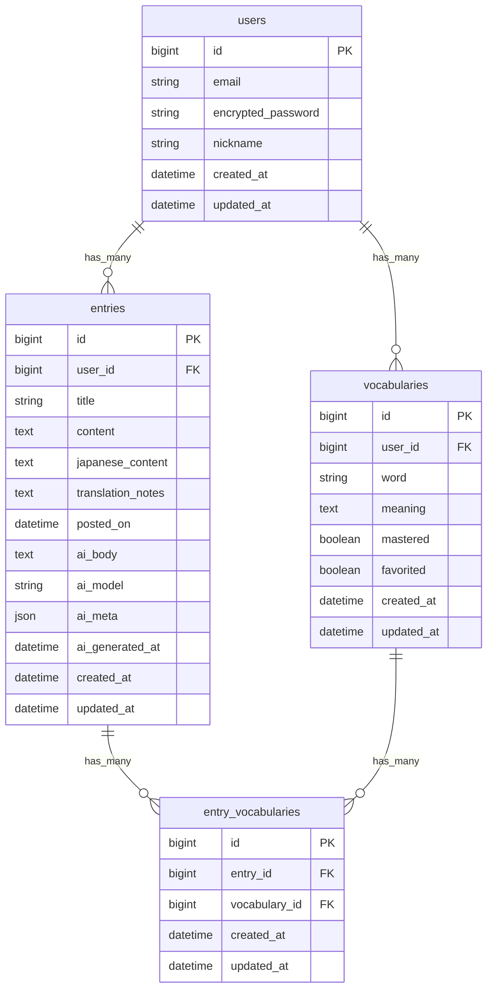

# AI Journal 

## 1. プロダクト概要

* **目的**: 日々の学習・振り返りを"AIフィードバック"で質的に高めるジャーナルアプリ。
* **想定ユーザー**: 英語学習者／自己省察を習慣化したい人。

## 2. 主要機能

### 2.1 日記機能（Entries）
* ユーザー登録/ログイン（Devise）
* 日記の投稿/編集/削除/一覧/詳細
* **カレンダー表示**：日付クリックでその日のエントリへ
* タグ付け & タグでのフィルタ
* AIフィードバック自動生成（OpenAI API）
* 日本語翻訳機能

### 2.2 MyDictionary機能（Vocabularies）✨
英語学習をサポートする単語帳機能

#### 単語登録
* **日記から登録**: 日記の本文中の英単語を選択して即座に登録
* **直接登録**: 日記に紐づかない単語も個別に登録可能
* **既存単語の編集**: 同じ単語を選択すると編集モードに自動切り替え

#### 単語管理
* 一覧表示：登録した単語を一覧で確認（ページネーション対応）
* 検索機能：リアルタイムで単語を検索
* フィルタ機能：「すべて」「未習得」「習得済み」「お気に入り」で絞り込み
* 編集/削除：単語と意味の両方を編集可能

#### フラッシュカード復習
* **カード表示**: 英→日、日→英の2モード切り替え
* **インタラクティブ操作**: 
  - クリックまたはスペースキーでカード反転
  - 左右矢印キーで前後の単語に移動
* **学習管理**: 
  - 習得済みマーク：学習済みの単語をマーク
  - お気に入りマーク：重要な単語をマーク
* **レスポンシブデザイン**: PC、タブレット、スマートフォンに対応

#### UI/UX機能
* **スティッキーヘッダー**: 日記詳細ページで登録単語が常に表示
* **トースト通知**: 単語登録・更新時に自動で通知表示
* **モーダル**: 単語選択から登録まで、ページ遷移なしで完結
* **連続登録**: 一つの日記から複数の単語を連続して登録可能

> **技術的特徴**: Ajax/Turbo、Stimulus.js、レスポンシブCSS、N+1クエリ対策

## 3. 非機能要件

* **認証・権限**: 自分の投稿・単語のみ編集/削除可
* **セキュリティ**: CSRF対策、Strong Parameters、APIキーは環境変数で管理
* **レイアウト**: レスポンシブ対応（モバイル、タブレット、デスクトップ）
* **パフォーマンス**: N+1クエリ対策（eager loading）、ページネーション
* **テスト**: RSpec（モデル、リクエスト）による自動テスト

## 4. 技術スタック

### バックエンド
* **言語**: Ruby 3.2.0
* **フレームワーク**: Ruby on Rails 7.1.0
* **DB**: PostgreSQL 14.19（本番）/ MySQL 8.0.42（開発）
* **認証**: Devise
* **AI**: OpenAI API（GPT-4）
* **ファイルストレージ**: Active Storage（開発=local、本番=S3）

### フロントエンド
* **JavaScript**: Stimulus.js（Hotwire）
* **CSS**: カスタムCSS（Flexbox、Grid、アニメーション）
* **UI/UX**: レスポンシブデザイン、モーダル、トースト通知

### インフラ・ツール
* **環境変数**: dotenv-rails
* **デプロイ**: Render
* **テスト**: RSpec、FactoryBot
* **ページネーション**: Kaminari

## 5. 画面フロー

### 日記フロー
1. サインアップ/ログイン
2. 日記一覧（カレンダー表示、タグフィルタ）
3. 新規日記作成（英語本文、日本語翻訳、画像添付）
4. 日記詳細（本文、AIフィードバック、登録単語表示）
5. 日記編集/削除

### MyDictionary フロー
1. 単語一覧（検索、フィルタ、ページネーション）
2. 単語登録
   - 日記から登録：日記ページで英単語を選択 → モーダル表示 → 登録
   - 直接登録：単語一覧から「新しい単語を追加」ボタン
3. 単語編集/削除
4. フラッシュカード復習
   - モード選択（英→日 / 日→英）
   - カード操作（前/次、反転）
   - 学習状態更新（習得済み、お気に入り）

## 6. データベース設計

### ER 図



### 主要な制約
* `vocabularies`: `user_id` + `word` でユニーク制約
* `entry_vocabularies`: `entry_id` + `vocabulary_id` でユニーク制約
* インデックス: `user_id`, `word`, `mastered`, `favorited`

## 7. テーブル設計

### users

| Column                | Type     | Options                   |
| --------------------- | -------- | ------------------------- |
| email                 | string   | null: false, unique: true |
| encrypted_password    | string   | null: false               |
| nickname              | string   | null: false               |
| created_at/updated_at | datetime |                           |

**Association**: 
- `has_many :entries, dependent: :destroy`
- `has_many :vocabularies, dependent: :destroy`

---

### entries

| Column                | Type     | Options                            |
| --------------------- | -------- | ---------------------------------- |
| user_id               | bigint   | null: false, foreign_key: true     |
| title                 | string   | null: false                        |
| content               | text     | null: false                        |
| japanese_content      | text     |                                    |
| translation_notes     | text     |                                    |
| posted_on             | datetime | null: false（デフォルト: now）        |
| ai_body               | text     |                                    |
| ai_model              | string   |                                    |
| ai_meta               | json     |                                    |
| ai_generated_at       | datetime |                                    |
| created_at/updated_at | datetime |                                    |

**Association**: 
- `belongs_to :user`
- `has_many :entry_vocabularies, dependent: :destroy`
- `has_many :vocabularies, through: :entry_vocabularies`
- `has_one_attached :image`

**Index**: `user_id`, `posted_on`

---

### vocabularies ✨

| Column                | Type     | Options                               |
| --------------------- | -------- | ------------------------------------- |
| user_id               | bigint   | null: false, foreign_key: true        |
| word                  | string   | null: false                           |
| meaning               | text     | null: false                           |
| mastered              | boolean  | default: false, null: false           |
| favorited             | boolean  | default: false, null: false           |
| created_at/updated_at | datetime |                                       |

**Association**: 
- `belongs_to :user`
- `has_many :entry_vocabularies, dependent: :destroy`
- `has_many :entries, through: :entry_vocabularies`

**Index**: 
- `user_id`
- `word`
- `mastered`
- `favorited`
- **Unique**: `[user_id, word]`（ユーザーごとに単語は一意）

**Scopes**:
- `recent`: 最新順
- `alphabetical`: アルファベット順
- `mastered`: 習得済み
- `unmastered`: 未習得
- `favorited`: お気に入り
- `search_by_word(query)`: 単語で検索

---

### entry_vocabularies（中間テーブル）✨

| Column                | Type     | Options                        |
| --------------------- | -------- | ------------------------------ |
| entry_id              | bigint   | null: false, foreign_key: true |
| vocabulary_id         | bigint   | null: false, foreign_key: true |
| created_at/updated_at | datetime |                                |

**Association**: 
- `belongs_to :entry`
- `belongs_to :vocabulary`

**Index**: 
- **Unique**: `[entry_id, vocabulary_id]`

---

## 8. バリデーション

### User
* `email`: presence, uniqueness, format（Devise標準）
* `password`: Devise標準（6文字以上）
* `nickname`: presence, length: 1..30

### Entry
* `title`: presence, length: 1..100
* `content`: presence, length: 1..10,000
* `posted_on`: presence

### Vocabulary ✨
* `user_id`: presence
* `word`: presence, length: 1..100, uniqueness scoped to `user_id`
* `meaning`: presence

### EntryVocabulary ✨
* `entry_id`: presence, uniqueness scoped to `vocabulary_id`
* `vocabulary_id`: presence

## 9. ルーティング

```ruby
Rails.application.routes.draw do
  devise_for :users
  root "entries#index"
  
  resources :entries do
    member do
      post :generate_ai_feedback
      post :generate_translation
    end
  end
  
  resources :vocabularies do
    collection do
      get :flashcard              # フラッシュカード復習ページ
      post :add_from_entry        # 日記から単語を追加（Ajax）
    end
    member do
      patch :toggle_mastered      # 習得済みトグル（Ajax）
      patch :toggle_favorited     # お気に入りトグル（Ajax）
    end
  end
end
```

## 10. AI機能

### OpenAI 連携フロー

1. **AIフィードバック生成**
   - ユーザーが日記を作成
   - 詳細ページで「AIフィードバックを生成」ボタンをクリック
   - サーバー側でOpenAI APIに本文を送信（同期処理）
   - 返ってきたフィードバックを `entries.ai_body` に保存
   - `ai_model`, `ai_meta`, `ai_generated_at` も記録

2. **日本語翻訳**
   - 英語の日記本文を日本語に翻訳
   - `entries.japanese_content` に保存
   - リアルタイムプレビュー機能

### サービスクラス構成

* `AiFeedbackGenerator` - AIフィードバック生成サービス
* `AiTranslator` - 日本語翻訳サービス

### 使用モデル
* GPT-4（`gpt-4`）- フィードバック生成
* GPT-4（`gpt-4`）- 翻訳

## 11. テスト

### テストカバレッジ
```
94 examples, 0 failures

内訳:
- Model: Entry, User, Vocabulary, EntryVocabulary
- Request: Entries, Vocabularies（全CRUD、認証・認可）
```

### テストツール
* **RSpec**: テストフレームワーク
* **FactoryBot**: テストデータ生成
* **Shoulda Matchers**: モデルテスト（バリデーション、アソシエーション）

## 12. セットアップ

### 前提条件
* Ruby 3.2.0
* Rails 7.1.0
* MySQL 8.0.42（開発）/ PostgreSQL 14.19（本番）
* Node.js 18+

### 環境構築手順

```bash
# リポジトリをクローン
git clone https://github.com/your-repo/ai_journal.git
cd ai_journal

# 依存関係をインストール
bundle install

# データベースを作成・マイグレーション
rails db:create
rails db:migrate

# 環境変数を設定（.envファイルを作成）
cp .env.example .env
# OPENAI_API_KEY=your_api_key を設定

# サーバーを起動
rails server
```

### 環境変数
```
OPENAI_API_KEY=your_openai_api_key
DATABASE_URL=your_database_url（本番のみ）
```

## 13. 今後の拡張予定

* [ ] 単語の音声再生機能
* [ ] 単語のスペルチェック
* [ ] 習得度に基づくスマートな復習システム
* [ ] 単語の使用例文の自動生成（AI）
* [ ] 単語テスト機能
* [ ] CSV/Excelエクスポート
* [ ] 学習統計・グラフ表示
* [ ] モバイルアプリ化（PWA）


